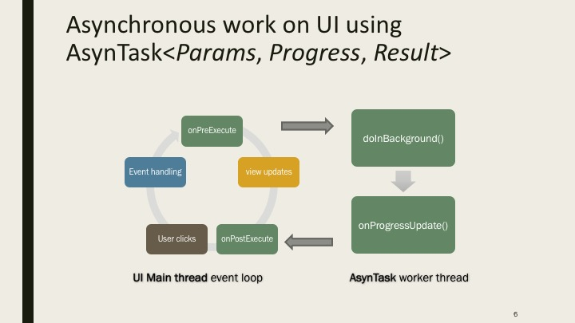
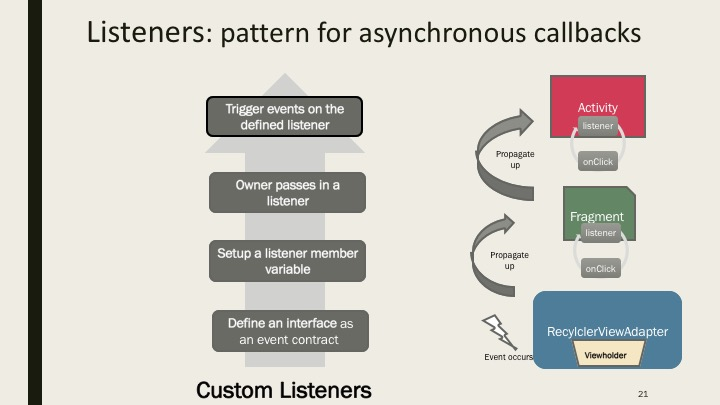
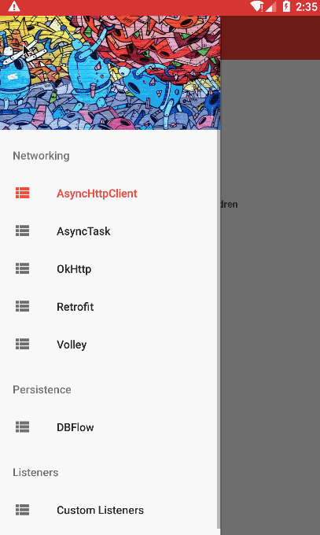

# Android Networking and Persistence samples using The Movie DB API
This is an Android demo application for displaying the latest box office movies using the [The Movie DB API](https://www.themoviedb.org/documentation/api/). 

## Overview
Purpose of this app is to demostrate usage of various networking and persistence libraries in Android


### Nerworking libraries samples
 * HttpURLConnection and AsyncTask
    * Follow [Displaying Remote Images (The "Hard" Way)](http://guides.codepath.com/android/Sending-and-Managing-Network-Requests#displaying-remote-images-the-hard-way) on our [cliffnotes](http://guides.codepath.com/) for a step-by-step tutorial.
    

 * [AsyncHTTPClient](http://loopj.com/android-async-http/) - A Callback-Based Http Client Library for Android
    * Follow [Using Android Async Http Client](http://guides.codepath.com/android/Using-Android-Async-Http-Client) on our [cliffnotes](http://guides.codepath.com/) for a step-by-step tutorial.
 * [Picasso](http://square.github.io/picasso/) - For remote image loading third party library
    * Follow [Displaying Images with the Picasso Library](http://guides.codepath.com/android/Displaying-Images-with-the-Picasso-Library) on our [cliffnotes](http://guides.codepath.com/) for a step-by-step tutorial.
 * [OkHttp](http://square.github.io/okhttp/) - An HTTP & HTTP/2 client for Android 
    * Follow [Using OkHttp](http://guides.codepath.com/android/Using-OkHttp) on our [cliffnotes](http://guides.codepath.com/) for a step-by-step tutorial. 
 * [Volley](https://developer.android.com/training/volley/index.html) - HTTP library that makes networking for Android apps easier and most importantly, faster.
    * Follow [Networking with the Volley Library](http://guides.codepath.com/android/Networking-with-the-Volley-Library) on our [cliffnotes](http://guides.codepath.com/) for a step-by-step tutorial.
 * [Retrofit](https://square.github.io/retrofit/) - A type-safe HTTP client for Android
    * Follow [Consuming APIs with Retrofit](http://guides.codepath.com/android/Consuming-APIs-with-Retrofit) on our [cliffnotes](http://guides.codepath.com/) for a step-by-step tutorial.


### ORM libraries samples

 * [DBFlow](https://github.com/Raizlabs/DBFlow) - A robust, powerful, and very simple ORM android database library with annotation processing
    * Follow [DBFlow Guide](http://guides.codepath.com/android/DBFlow-Guide) on our [cliffnotes](http://guides.codepath.com/) for a step-by-step tutorial.


### App features
 * [Fragment navgation drawer](http://guides.codepath.com/android/Fragment-Navigation-Drawer)
 * Use of [Action bar](http://guides.codepath.com/android/Extended-ActionBar-Guide)
 * Displays list of movies using [RecyclerView](http://guides.codepath.com/android/Using-the-RecyclerView)
 * Displays content using [Fragments](http://guides.codepath.com/android/Creating-and-Using-Fragments)
 * Demonstrates use of [Creating Custom Listeners](http://guides.codepath.com/android/Creating-Custom-Listeners)
   

### Gif



## Installation

Quick note is that you must **provide your own API key** for The Movie DB API in order to use this demo. To get an API key, you need to [register for an account](https://www.themoviedb.org/account/signup) (or [sign in](https://www.themoviedb.org/login)). Once you have the key, put the key into the `API_KEY` constant in the `./app/src/main/res/values/secrets.xml` file: 

```xml
<resources>
    <string name="api_key">XXXX</string>
</resources>
```

Once you've setup the key and imported the project into Android Studio, you should be all set.

## Attribution
 
This code was created by [Shrikant Pandhare](https://github.com/shrikant0013) in 2016 for use in CodePath sessions.